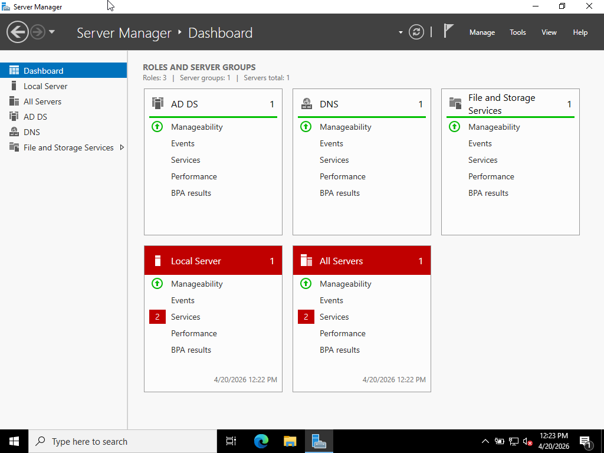
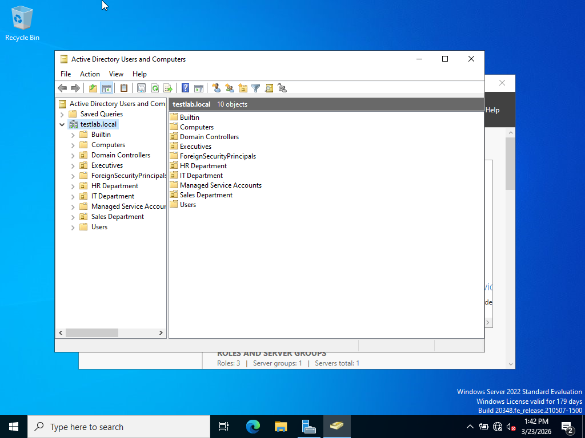
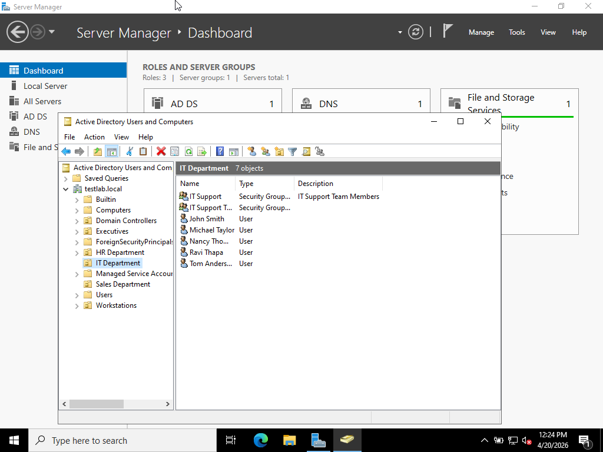
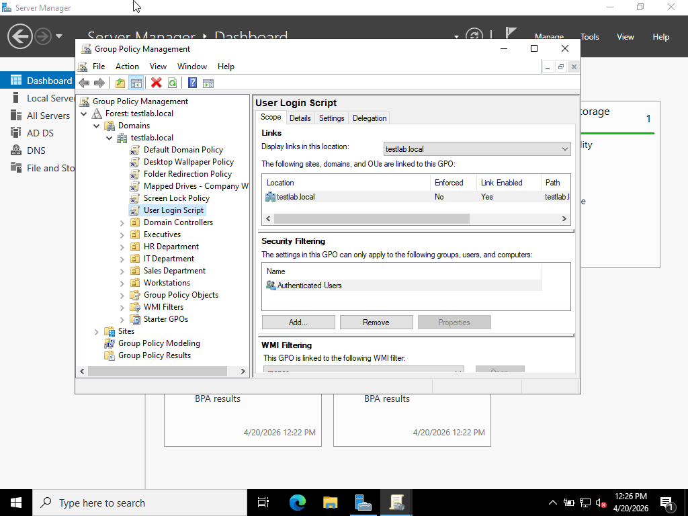
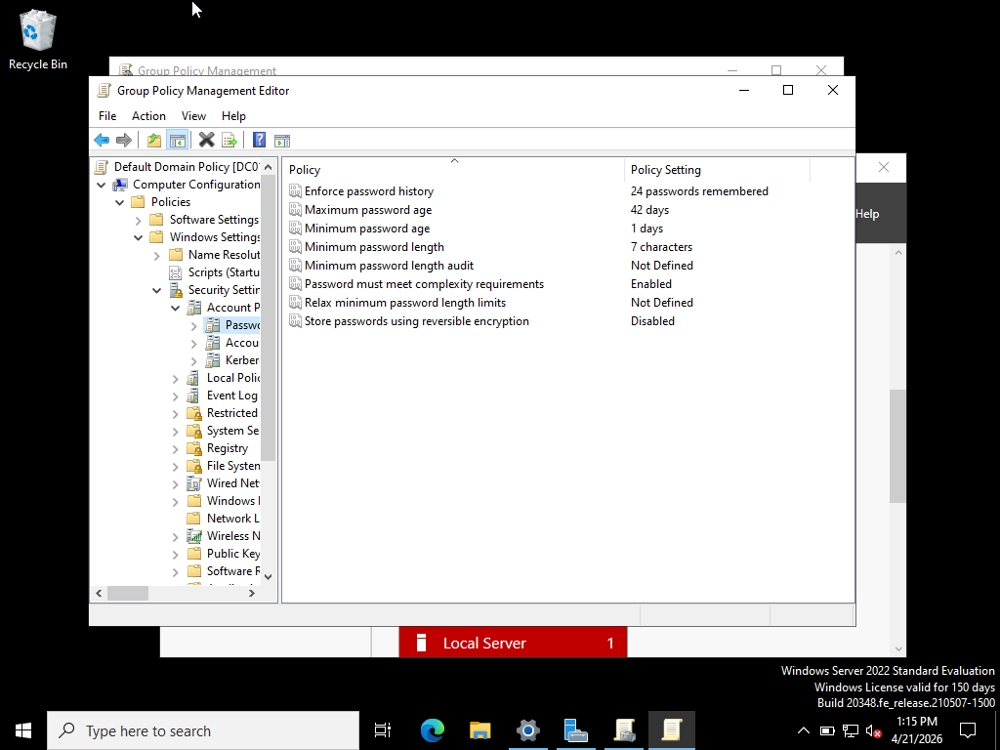
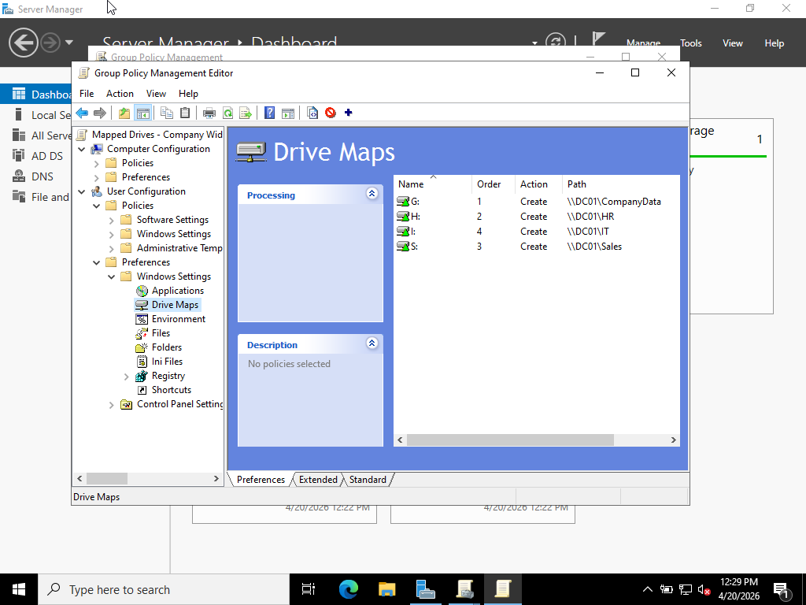
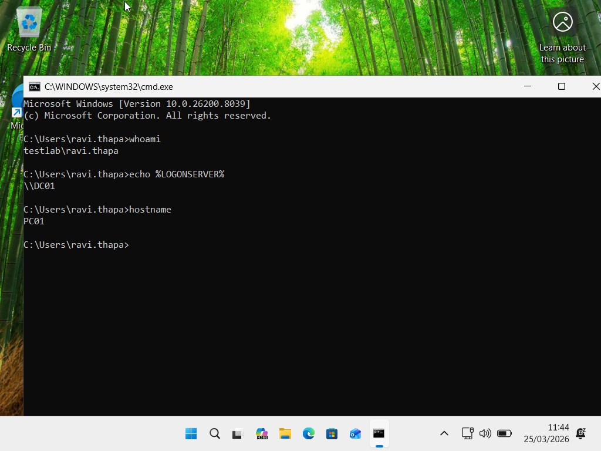
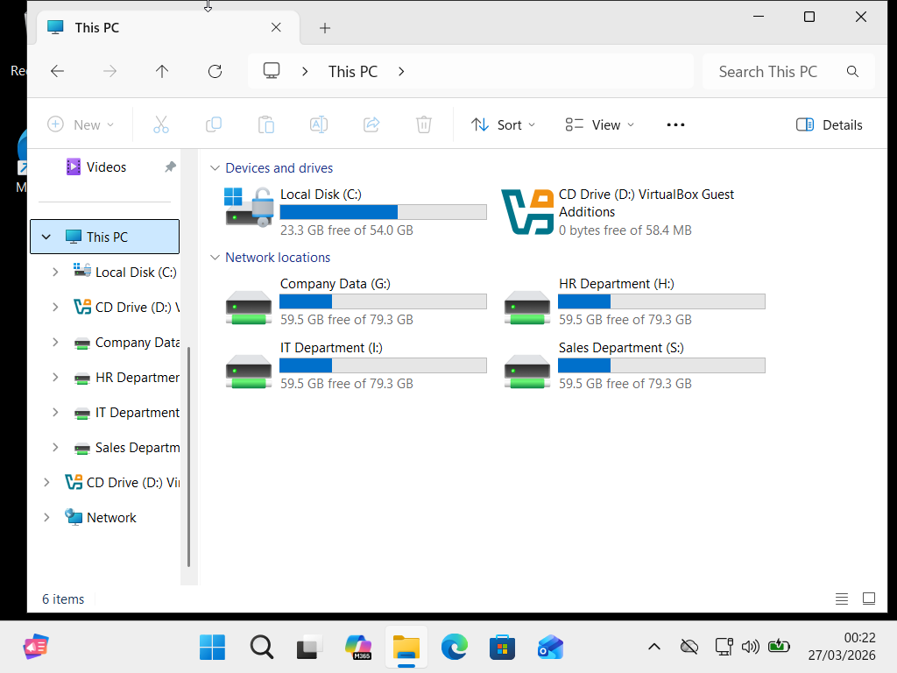
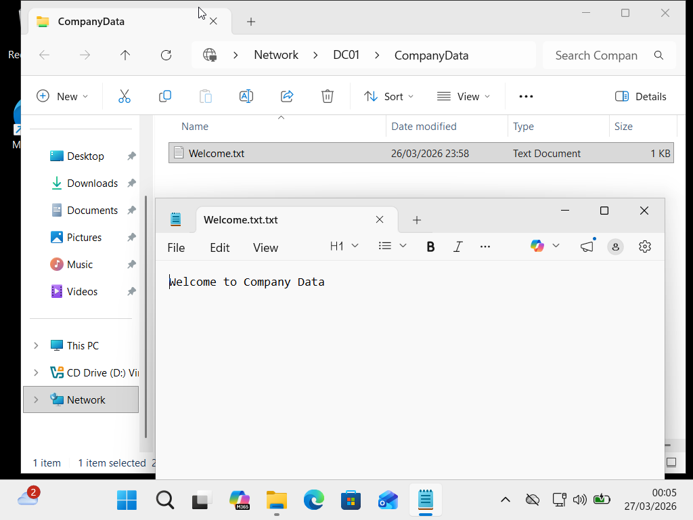

# Active Directory Enterprise Lab

## 📋 Project Overview

Built a complete Windows Server 2022 Active Directory domain environment to simulate enterprise IT infrastructure and practice system administration skills.

**Duration:** March 2026  
**Environment:** VirtualBox on Windows 11 Host  
**Scope:** Full domain deployment with 25+ users and enterprise policies  
**Domain:** testlab.local

---

## 🏗️ Infrastructure Architecture

```
┌─────────────────────────────────────────────────────┐
│            testlab.local Domain                     │
├─────────────────────────────────────────────────────┤
│                                                     │
│  ┌──────────────────┐      ┌──────────────────┐     │
│  │      DC01        │      │       PC01       │     │
│  │ Windows Server   │◄────►│   Windows 11     │     │
│  │     2022         │      │      Pro         │     │
│  │                  │      │                  │     │
│  │ • Domain Ctrl    │      │ • Domain Joined  │     │
│  │ • DNS Server     │      │ • GPO Enforced   │     │
│  │ • DHCP Server    │      │ • Mapped Drives  │     │
│  │ • File Server    │      │ • Roaming Profile│     │
│  └──────────────────┘      └──────────────────┘     │
│                                                     │
│  Network: NAT Network (10.0.2.0/24)                 │
│  DNS: Integrated with AD DS                         │
│  DHCP: Automatic IP Assignment                      │
└─────────────────────────────────────────────────────┘
```

---

## ✅ What I Built

### Infrastructure Components

- ✅ **Windows Server 2022** promoted to Domain Controller
- ✅ **Active Directory Domain Services** installed and configured
- ✅ **Integrated DNS Server** for domain name resolution
- ✅ **DHCP Server** for automated IP address assignment
- ✅ **Windows 11 Pro Client** successfully domain-joined
- ✅ **VirtualBox NAT Network** for VM-to-VM communication

### Organizational Structure

- ✅ **25+ User Accounts** created with proper attributes
- ✅ **5 Organizational Units:**
  - IT Department
  - HR Department
  - Sales Department
  - Executives
  - Workstations
- ✅ **6+ Security Groups** with appropriate members
- ✅ **Automated Bulk User Creation** via PowerShell CSV import

### Group Policy Implementation

#### 🔐 Password Policy GPO
- **Minimum password length:** 12 characters
- **Password complexity:** Enabled (uppercase, lowercase, numbers, symbols)
- **Maximum password age:** 90 days
- **Password history:** 24 passwords remembered
- **Minimum password age:** 1 day
- **Account lockout threshold:** 5 failed attempts
- **Account lockout duration:** 30 minutes
- **Reset lockout counter after:** 30 minutes

**Result:** Meets enterprise security standards and compliance requirements (PCI DSS, HIPAA baseline)

#### 📁 Network Drive Mapping GPO
- **G: Drive** → `\\DC01\CompanyData` (All users)
- **H: Drive** → `\\DC01\HR` (HR Team only)
- **I: Drive** → `\\DC01\IT` (IT Support Team only)
- **S: Drive** → `\\DC01\Sales` (Sales Team only)

**Implementation:** GPO Preferences with item-level targeting based on security group membership

#### 🔄 Folder Redirection GPO
- **Desktop** → `\\DC01\UserRedirection$\%USERNAME%\Desktop`
- **Documents** → `\\DC01\UserRedirection$\%USERNAME%\Documents`

**Benefits:** 
- Centralized user data storage
- Roaming profiles (same desktop on any PC)
- Centralized backup capability
- Disaster recovery ready

**Security:** CREATOR OWNER permissions configured for user data privacy

#### 🖥️ Additional GPOs Implemented
- **Login Script:** Welcome message with date/time
- **Screen Lock:** 10-minute inactivity timeout
- **Desktop Wallpaper:** Corporate wallpaper enforcement
- **Administrative Tools:** IT Department-specific tools visibility
- **Software Restrictions:** Block unauthorized executables (AppLocker ready)

### File Services & Permissions

- ✅ **4 Network Shares** created with security
- ✅ **NTFS Permissions** properly configured
- ✅ **Share Permissions** appropriately set
- ✅ **Security Group-Based Access** implemented
- ✅ **Hidden Administrative Shares** configured ($)
- ✅ **Folder Redirection Storage** with CREATOR OWNER

### User Management

- ✅ **Manual User Creation** via Active Directory Users and Computers
- ✅ **PowerShell Bulk Creation** using CSV import
- ✅ **User Properties** fully populated (email, department, title)
- ✅ **Password Management** with forced change at first logon
- ✅ **Security Group Membership** automated based on department

---

## 🛠️ Technical Skills Demonstrated

### Active Directory Administration
- Domain Controller promotion and configuration
- Forest and domain functional level management
- DNS integration with Active Directory
- Global Catalog server configuration
- Site and Services basics

### Group Policy Management
- GPO creation and linking to OUs
- Security filtering and WMI filtering
- GPO Preferences vs GPO Policies understanding
- Item-level targeting implementation
- GPO backup, restore, and import/export
- Group Policy modeling and results (RSOP)
- GPO troubleshooting (gpupdate, gpresult)

### Security & Permissions
- NTFS permissions configuration
- Share permissions management
- Security group strategy and implementation
- Password policy enforcement
- Account lockout policies
- Access control best practices

### PowerShell Automation
- Bulk user creation from CSV
- Automated username generation
- Error handling in scripts
- Active Directory module usage
- Parameter validation

### Network Services
- DNS zone configuration
- Forward and reverse lookup zones
- DHCP scope creation and management
- IP address reservation
- Domain joining procedures

### Troubleshooting & Diagnostics
- Event Viewer log analysis
- GPO troubleshooting
- Network connectivity diagnostics
- DNS resolution verification
- Replication monitoring

---

## 📸 Screenshots

*Screenshots documenting the lab setup and configuration:*

### Domain Controller Configuration

*Windows Server 2022 with AD DS, DNS, and DHCP roles installed*

### Active Directory Structure

*Organizational Unit structure with all departments*


*User accounts in IT Department OU*

### Group Policy Management

*All implemented Group Policy Objects*


*Enterprise password policy configuration*


*Network drive mapping via GPO Preferences*

### Client Configuration

*Windows 11 Pro successfully joined to company.local domain*


*Automatically mapped network drives on client machine*

### Network Services

*File server shares accessible via \\DC01*

---

## 💡 Key Learnings

### 1. DNS is Critical for Active Directory
**Learning:** AD DS absolutely requires DNS. Without properly configured DNS, domain controller promotion fails.

**Application:** Always verify DNS forward and reverse lookup zones before domain operations.

### 2. GPO Processing Order: LSDOU
**Learning:** Group Policies process in order: Local → Site → Domain → OU. Last applied wins.

**Application:** Place most specific policies at OU level for proper inheritance and overrides.

### 3. NTFS vs Share Permissions
**Learning:** Most restrictive permission applies when both NTFS and Share permissions exist.

**Application:** Set Share permissions broadly, control access granularly with NTFS.

### 4. Folder Redirection Security
**Learning:** CREATOR OWNER is essential for folder redirection to ensure users only access their own data.

**Application:** Never use "Everyone" or overly broad permissions on redirection targets.

### 5. PowerShell Automation Value
**Learning:** Creating 25 users manually takes 2+ hours. PowerShell CSV import takes 2 minutes.

**Application:** Automate repetitive tasks. Initial script development saves massive time long-term.

### 6. GPO Troubleshooting Methodology
**Learning:** gpupdate /force doesn't always refresh policies. Sometimes logout/login or reboot needed.

**Application:** Use gpresult /r to verify which policies applied. Check Event Viewer for GPO errors.

### 7. Security Group Strategy
**Learning:** Resource permissions should be assigned to groups, not individual users.

**Application:** Use "AGDLP" strategy: Accounts → Global Groups → Domain Local Groups → Permissions.

---

## 🔧 Tools & Technologies Used

| Tool/Technology | Purpose |
|----------------|---------|
| **VirtualBox 7.0** | Virtualization platform for lab environment |
| **Windows Server 2022** | Domain Controller operating system |
| **Windows 11 Pro** | Domain-joined client workstation |
| **Active Directory Users and Computers** | User and OU management |
| **Group Policy Management Console** | GPO creation and management |
| **DNS Manager** | DNS zone configuration |
| **DHCP Console** | IP address management |
| **PowerShell ISE** | Script development and testing |
| **Event Viewer** | Troubleshooting and log analysis |
| **Command Prompt** | Network diagnostics (ping, ipconfig, nslookup) |

---

## 📈 Future Enhancements

### Planned Improvements

- [ ] **Add Second Domain Controller** for redundancy and load balancing
- [ ] **Implement DHCP Failover** for high availability
- [ ] **Configure Sites and Services** for multi-site simulation
- [ ] **Practice Disaster Recovery** scenarios (DC restore, AD recycle bin)
- [ ] **Implement Certificate Services** (PKI infrastructure)
- [ ] **Add Linux Client** for heterogeneous environment practice
- [ ] **Implement RADIUS/NPS** for network authentication
- [ ] **Configure DFS** (Distributed File System) for file replication
- [ ] **Add Exchange Server** for email services practice
- [ ] **Implement WSUS** for Windows update management

### Skills to Develop Further

- Active Directory Certificate Services (AD CS)
- Federation Services (AD FS)
- Rights Management Services (AD RMS)
- Advanced GPO troubleshooting
- Performance monitoring and optimization
- Backup and recovery procedures
- PowerShell DSC (Desired State Configuration)

---

## 📚 Resources Used

### Official Documentation
- Microsoft Learn: Active Directory Domain Services
- Microsoft Docs: Group Policy
- PowerShell Documentation

### Learning Resources
- CompTIA A+ Course Materials
- Windows Server 2022 Administration Guide
- Active Directory Best Practices (Microsoft)

### Community Resources
- r/sysadmin subreddit
- TechNet forums
- Stack Overflow

---

## 🔗 Related Projects

- **[PowerShell Automation Scripts](../PowerShell-Scripts/)** - Scripts used for bulk operations
- **[Windows Server Networking Lab](../Network-Lab/)** - DNS and DHCP configuration
- **[IT Support Simulations](../IT-Support-Simulations/)** - Helpdesk practice

---

## 📞 Questions or Feedback?

If you have questions about this project or would like to discuss Active Directory administration, feel free to reach out!

📧 **Email:** iamrtmfd@gmail.com  
💼 **LinkedIn:** [linkedin.com/in/thapa-ravi](https://www.linkedin.com/in/thapa-ravi/)

---

[⬅️ Back to Main Portfolio](../README.md)
