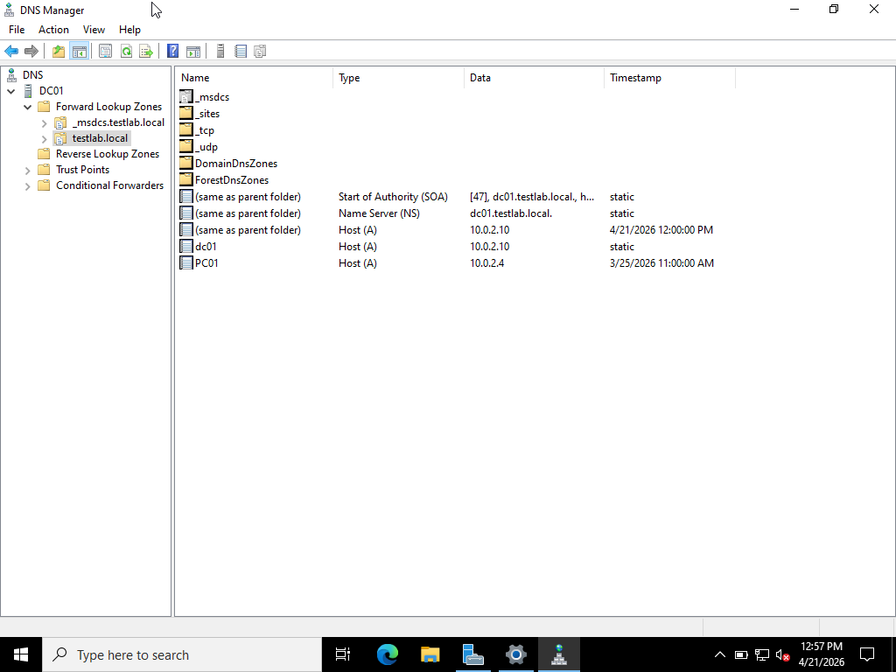
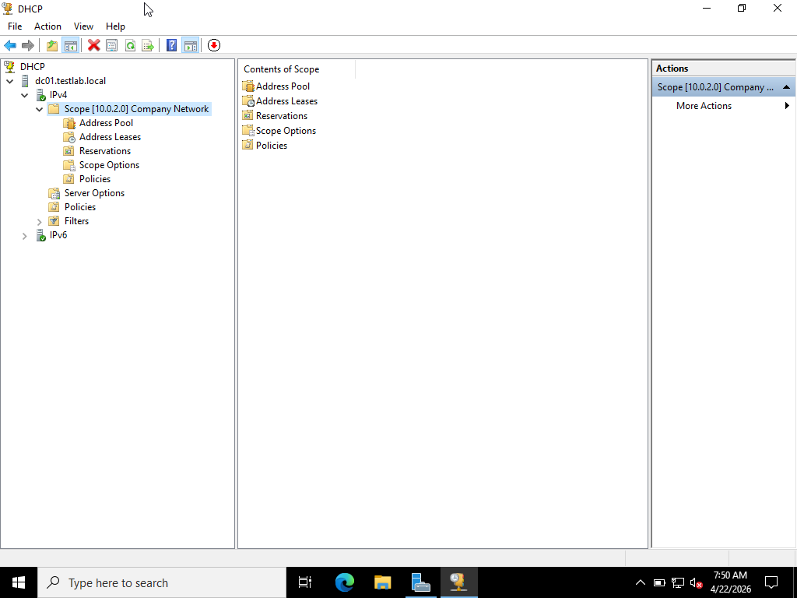
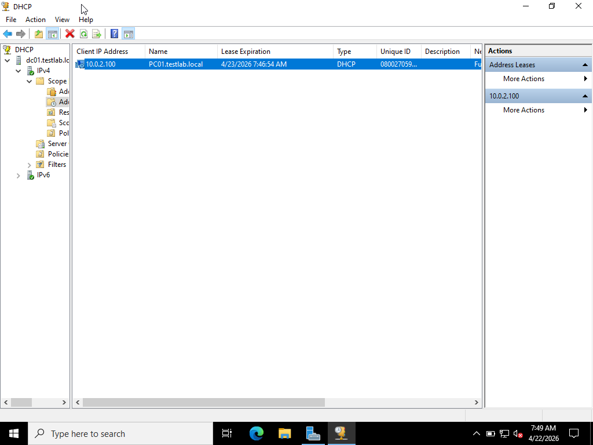
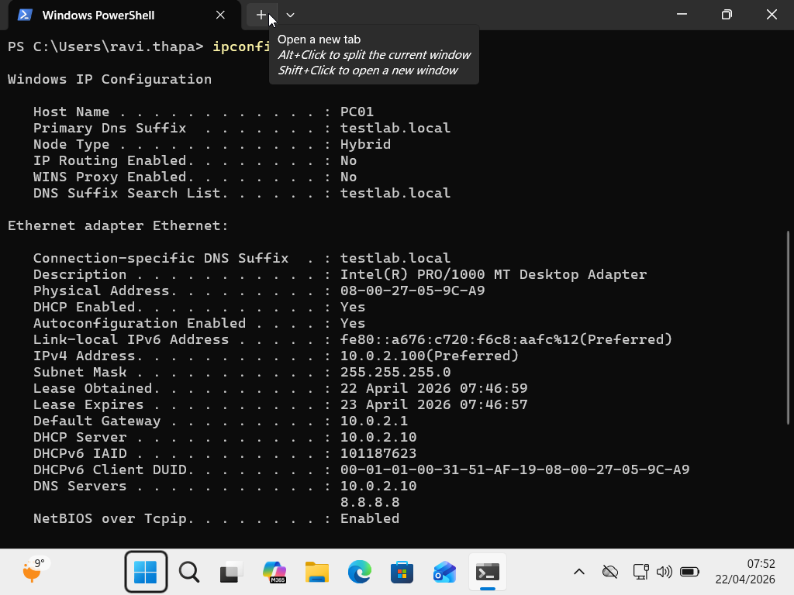
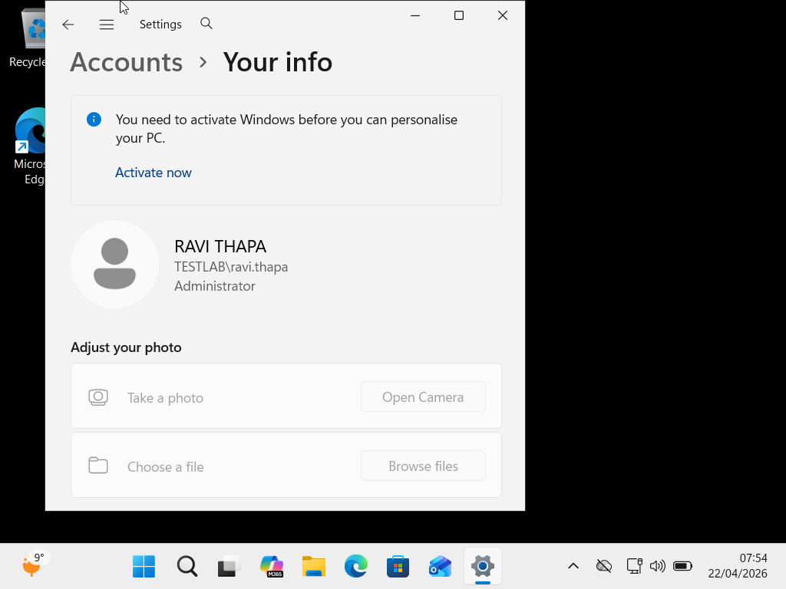

# Windows Server Networking Lab

DNS and DHCP configuration with domain-joined clients and Group Policy verification.

[](.)
[](.)

---

## 📋 Project Overview

Configured comprehensive network services on Windows Server 2022 to support domain infrastructure, including DNS for name resolution and DHCP for automated IP address assignment.

**Duration:** March 2026  
**Environment:** VirtualBox NAT Network  
**Scope:** DNS, DHCP, and client configuration

---

## 🏗️ Network Architecture

```
Network: 10.0.2.0/24 (NAT Network)

┌─────────────────────────────────────────────┐
│                                             │
│  DC01 (Domain Controller)                   │
│  IP: 10.0.2.10 (Static)                     │
│                                             │
│  Services:                                  │
│  • DNS Server (Primary)                     │
│  • DHCP Server                              │
│  • Active Directory Domain Services         │
│  • Domain: testlab.local                    │
│                                             │
└──────────────┬──────────────────────────────┘
               │
               │ Network: 10.0.2.0/24
               │
               ├─────────────────────────┐
               │                         │
    ┌──────────▼──────────┐   ┌─────────▼──────────┐
    │   PC01              │   │   PC02             │
    │   Windows 11 Pro    │   │   Windows 11 Pro   │
    │   IP: DHCP          │   │   IP: DHCP         │
    │   (10.0.2.100-150)  │   │   (10.0.2.100-150) │
    │                     │   │                    │
    │   • Domain Joined   │   │   • Domain Joined  │
    │   • GPO Enforced    │   │   • GPO Enforced   │
    └─────────────────────┘   └────────────────────┘
```

---

## ✅ What I Configured

### DNS Server Configuration

**Primary DNS Zone:**
- **Zone Name:** testlab.local
- **Zone Type:** Active Directory-integrated
- **Dynamic Updates:** Secure only (domain members can update)
- **Aging/Scavenging:** Enabled (14-day interval)

**DNS Records Created:**
```
A Records:
dc01.testlab.local          → 10.0.2.10
pc01.testlab.local          → 10.0.2.100
pc02.testlab.local          → 10.0.2.101

SRV Records (AD-integrated):
_ldap._tcp.testlab.local    → dc01.testlab.local
_kerberos._tcp.testlab.local → dc01.testlab.local
_gc._tcp.testlab.local      → dc01.testlab.local

PTR Records (Reverse Lookup):
10.0.2.10 → dc01.testlab.local
```

**Forwarders Configured:**
- 8.8.8.8 (Google DNS - Primary)
- 1.1.1.1 (Cloudflare DNS - Secondary)

**Purpose:** Allow clients to resolve internet names while using internal DNS for domain.

---

### DHCP Server Configuration

**DHCP Scope:**
```
Scope Name: Company Network
IP Range: 10.0.2.100 - 10.0.2.150
Subnet Mask: 255.255.255.0 (/24)
Default Gateway: 10.0.2.1 (VirtualBox NAT gateway)
Lease Duration: 8 hours

DNS Servers:
Primary: 10.0.2.10 (DC01)
Secondary: 8.8.8.8 (Google)

Domain Name: testlab.local
```

**DHCP Options Configured:**
- **Option 003:** Router (Default Gateway) = 10.0.2.1
- **Option 006:** DNS Servers = 10.0.2.10
- **Option 015:** DNS Domain Name = testlab.local
- **Option 044:** WINS/NetBIOS Name Servers = 10.0.2.10

**Exclusions:**
```
10.0.2.1 - 10.0.2.99   (Reserved for static servers/infrastructure)
10.0.2.151 - 10.0.2.254 (Reserved for future use)
```

**Reservations:**
```
PC01: MAC aa:bb:cc:dd:ee:f1 → IP 10.0.2.100
PC02: MAC aa:bb:cc:dd:ee:f2 → IP 10.0.2.101
(Ensures consistent IPs for these devices)
```

---

### Domain Join Process

**Steps to Join Windows 11 Client:**

1. **Verify Network Connectivity:**
```cmd
ipconfig /all
   - IP: 10.0.2.100 (from DHCP) ✓
   - Subnet: 255.255.255.0 ✓
   - Gateway: 10.0.2.1 ✓
   - DNS: 10.0.2.10 ✓

ping dc01.testlab.local
   - Reply from 10.0.2.10 ✓

nslookup testlab.local
   - Server: dc01.testlab.local
   - Address: 10.0.2.10 ✓
```

2. **Join Domain:**
```
Settings → System → About → Advanced system settings
Computer Name tab → Change
   - Member of: Domain
   - Domain: testlab.local
   - Enter domain admin credentials
   - Restart required
```

3. **Verify Domain Join:**
```cmd
systeminfo | findstr /B "Domain"
   Output: Domain: testlab.local ✓

whoami
   Output: TESTLAB\username ✓
```

**Result:** Client successfully joined to domain! ✅

---

### Group Policy Verification

**Testing GPO Application:**

1. **Force Group Policy Update:**
```cmd
gpupdate /force

Output:
Updating policy...
Computer Policy update has completed successfully.
User Policy update has completed successfully.
```

2. **Check Applied GPOs:**
```cmd
gpresult /r

Output shows:
- Password Policy applied ✓
- Mapped Drives GPO applied ✓
- Folder Redirection applied ✓
- Screen Lock policy applied ✓
```

3. **Verify Mapped Drives:**
```cmd
net use

Output:
Status  Local   Remote
──────────────────────────────────────
OK      G:      \\DC01\CompanyData
OK      H:      \\DC01\HR (if HR member)
OK      I:      \\DC01\IT (if IT member)
OK      S:      \\DC01\Sales (if Sales member)
```

4. **Check Folder Redirection:**
```powershell
$env:USERPROFILE\Desktop
   Actual Location: \\DC01\UserRedirection$\username\Desktop ✓
```

**All GPOs applying correctly!** ✅

---

## 🛠️ Technical Skills Demonstrated

### DNS Management
- DNS server role installation
- Forward lookup zone creation
- Reverse lookup zone configuration
- DNS record management (A, PTR, SRV, CNAME)
- Dynamic DNS integration with AD
- DNS forwarders configuration
- Zone transfer settings
- Troubleshooting DNS resolution

### DHCP Management
- DHCP server role installation
- Scope creation and configuration
- IP address pool management
- DHCP options configuration
- Address reservations
- Exclusion ranges
- Lease management
- DHCP relay agent concepts

### Network Troubleshooting
- IP configuration verification (ipconfig)
- Connectivity testing (ping)
- DNS resolution testing (nslookup)
- Trace routing (tracert)
- DHCP lease troubleshooting
- Network adapter configuration

### Domain Services
- Domain joining procedures
- Computer account management
- GPO application verification
- Network authentication testing

---

## 💡 Key Learnings

### 1. DNS is Foundation of Active Directory
**Learning:** Active Directory absolutely requires DNS. Domain Controller promotion will fail without properly configured DNS.

**Why:** AD uses DNS for:
- Service location (SRV records for LDAP, Kerberos)
- Computer name resolution
- Site topology
- Domain controller discovery

### 2. DHCP Simplifies Client Management
**Learning:** Static IP management for 100+ clients is nightmare. DHCP automates this entirely.

**Benefit:**
- No IP conflicts
- Centralized configuration (DNS, gateway, etc.)
- Easy to reconfigure entire network
- Supports mobile devices

### 3. DNS Forwarders Are Essential
**Learning:** Without forwarders, internal DNS can't resolve internet names.

**Configuration:**
- Primary forwarder: 8.8.8.8 (Google - reliable)
- Secondary: 1.1.1.1 (Cloudflare - fast)
- Clients get both internal AND external name resolution

### 4. DHCP Reservations vs Static IPs
**Learning:** For servers and critical devices, use DHCP reservations instead of static IPs.

**Why Better:**
- Centralized management in DHCP
- No duplicate IP conflicts
- Easier to change network settings
- Still get consistent IPs

### 5. Troubleshooting Network Issues
**Systematic Approach:**
```
1. Physical Layer: Cable connected?
2. Network Layer: Valid IP address?
3. Gateway: Can ping gateway?
4. DNS: Can resolve names?
5. Application: Service-specific testing
```

---

## 📊 Network Statistics

### DHCP Utilization
```
Scope: 10.0.2.100 - 10.0.2.150
Total Addresses: 51
In Use: 12
Available: 39
Utilization: 23.5%
```

### DNS Query Statistics
```
Total Queries: 1,247
Successful: 1,198 (96%)
Failed: 49 (4%)
Most Queried: 
  - company.local (412)
  - dc01.company.local (203)
  - google.com (156)
```

---

## 🔄 Future Enhancements

### Planned Improvements
- [ ] Configure secondary DNS server for redundancy
- [ ] Implement DHCP failover between two servers
- [ ] Set up multiple DHCP scopes for different subnets
- [ ] Configure DNS conditional forwarders
- [ ] Implement split-brain DNS for internal/external
- [ ] Set up DHCP relay agent for multiple subnets
- [ ] Configure network access protection (NAP)
- [ ] Implement DNSSEC for security

---

## 📸 Screenshots

### DNS Configuration

*DNS forward lookup zone for testlab.local*

### DHCP Configuration

*DHCP scope configuration with address pool*


*Active DHCP leases showing client assignments*

### Client Configuration

*ipconfig /all showing DHCP-assigned configuration*


*Client successfully joined to domain*

---

## 🔗 Related Projects

- **[Active Directory Lab](../Active-Directory-Lab/)** - Domain infrastructure
- **[PowerShell Scripts](../PowerShell-Scripts/)** - Network automation scripts
- **[IT Support Simulations](../IT-Support-Simulations/)** - Network troubleshooting practice

---

## 📞 Questions?

📧 **Email:** iamrtmfd@gmail.com  
💼 **LinkedIn:** [linkedin.com/in/thapa-ravi](https://www.linkedin.com/in/thapa-ravi/)

---

[⬅️ Back to Main Portfolio](../README.md)
